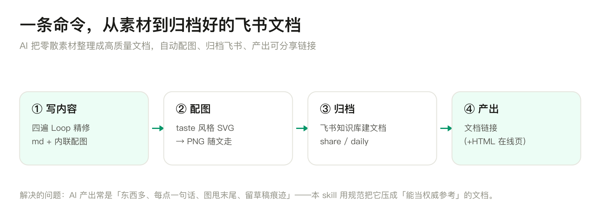
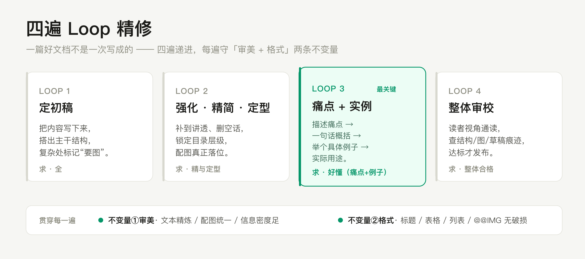

<div align="center">

# 📝 doc-generate-skill

**把 AI 生成的零散内容，自动整理成「能当权威参考」的高质量文档，并归档到飞书知识库。**

不只是存文件 —— 它用规范约束 AI 把内容写好、自动配图、产出可分享链接。

<br>



</div>

---

## 🤔 解决什么问题

AI 直接产出的文档，常有四个通病：

| 通病 | 本 skill 的对治 |
|---|---|
| 东西多，但每点只有干巴一句话 | **Loop 3** 强制「痛点 + 例子 + 用途」，每点讲到有画面 |
| 只罗列「误区」，不讲痛点、没有实例 | 以**痛点 + 真实例子**为主线，误区只作补充 |
| 篇幅太省，读者还没看懂就没了 | **宁长勿短**：四件套展开撑足，留删减空间而非一上来就极简 |
| 结构是 `1. 2. 3.` 流水账 | 文档大师约束：真实多级层次（H2/H3/H4） |
| 图甩在末尾、或干脆没图 | 复杂处自动配 taste 风格图，`@@IMG` **随文走** |
| 留「预备稿 / 本文将介绍」草稿痕迹 | 零草稿痕迹，正文直接进内容 |

一句话：**把"AI 草稿"压成"专业作者交付物"，再一键归档飞书。**

---

## ✨ 能做什么

- **四遍 Loop 精修** —— 初稿 → 强化/精简/定结构 → 痛点+例子+用途讲具象 → 整体审校；每遍守「审美 + 格式」两条不变量。
- **自动配图** —— 手写浅色高级 SVG → `rsvg-convert` 转 PNG，用 `@@IMG:路径|说明@@` 内联到对应章节。
- **飞书归档** —— 分享/学习类 → 知识库；日常自动生成 → 按 月/日 目录。每篇新建。
- **HTML 在线页** —— 内置 `taste-light.css` 一套浅色高级样式，`--html` 自动上传拿链接。



---

## 🗂 归档落点

文档归档到一棵飞书 wiki 树；两个父节点的 token 在 `config.local.env` 配，不写死在代码里。


---

## ✅ 前置依赖与权限

> 跑 `./setup.sh` 会**逐项自动检查**下面这些。

| 项 | 必需 | 用途 / 怎么准备 |
|---|:--:|---|
| **lark-cli** | ✅ | 建 wiki 节点、读写 docx、插图、发消息都靠它。需 `lark-cli auth login` 以 **user** 身份授权，scope 覆盖 wiki 节点创建 / docx 读写 / drive 媒体上传 / im 发消息。 |
| **飞书 wiki 落点** | ✅ | 一个 wiki 空间 + 两个父节点（分享类 `FEISHU_PARENT_SHARE`、日常类 `FEISHU_ROOT_AUTO`）。在飞书建好，把 token 填进配置。 |
| **python3** | ✅ | 脚本解析 JSON / 顺序灌内容。 |
| **rsvg-convert** | 配图需要 | SVG→PNG，`brew install librsvg`。 |
| matplotlib / Pillow | 可选 | 仅画数据图表时需要。 |
| **HTML 上传通道** | `--html` 需要 | 一台 SSH 可达的服务器（或自行改成 S3）+ 私钥 + 个人目录。不配则 `--html` 不可用，纯 md 文档不受影响。 |
| 通知 webhook | 可选 | `--notify` 把链接 POST 过去（如本地通知服务）。 |

> taste 浅色高级视觉**无需额外下载** —— CSS 已内置在 `assets/taste-light.css`，配图配色常量写在 `SKILL.md`。

---

## 🚀 安装 / 配置

```bash
git clone https://github.com/mayangzz/doc-generate-skill.git
cd doc-generate-skill
./setup.sh        # 检查依赖 + 引导填写，生成 config.local.env
```

`config.local.env` 由 `setup.sh` 生成（模板见 [`config.example.env`](config.example.env)），含密钥与私有 token，已被 `.gitignore` 忽略，**绝不进 git**。

让 AI 工具（如 Claude Code）用它：把本目录复制/软链到其 skills 目录，或直接让它读 [`SKILL.md`](SKILL.md)。

---

## 📖 用法

```bash
# 分享/学习类 → 知识库
scripts/publish-doc.sh --kind share --title "大模型核心概念" --md doc.md [--html doc.html] [--notify]

# 日常自动生成 → 当月 / Agent Y-M-D
scripts/publish-doc.sh --kind daily --md daily.md [--notify]
```

输出 `doc_url=`（飞书文档链接），用了 `--html` 还会有 `html_url=`。

md 里用单独一行 `@@IMG:/abs/path.png|图说明@@` 标记配图，脚本会自上而下顺序构建，把图落在那一节。

---

## 📁 目录结构

```
doc-generate-skill/
├── README.md
├── SKILL.md              # 给 AI 读的规范（文档大师约束 + 四遍 Loop + 视觉语言）
├── setup.sh              # 首次启动：检查依赖 + 写 config.local.env
├── config.example.env    # 配置模板（committed）
├── .gitignore            # 忽略 config.local.env
├── scripts/
│   ├── publish-doc.sh    # 编排：建文档→灌内容(含内联图)→出链接→可选通知
│   └── upload-html.sh    # HTML 上传（scp，可改 S3）
└── assets/
    ├── taste-light.css   # 浅色高级 HTML 样式
    └── img/              # README 配图
```

---

## 🔖 版本与安全

- 版本管理：语义化版本 + git tag（见 [`CHANGELOG.md`](CHANGELOG.md)），当前 `v0.1.0`。
- 安全：密钥 / 私有 token 只在 `config.local.env`（权限 600，gitignored）；仓库零敏感信息，`config.example.env` 全是占位。
- 许可：[MIT](LICENSE)。
